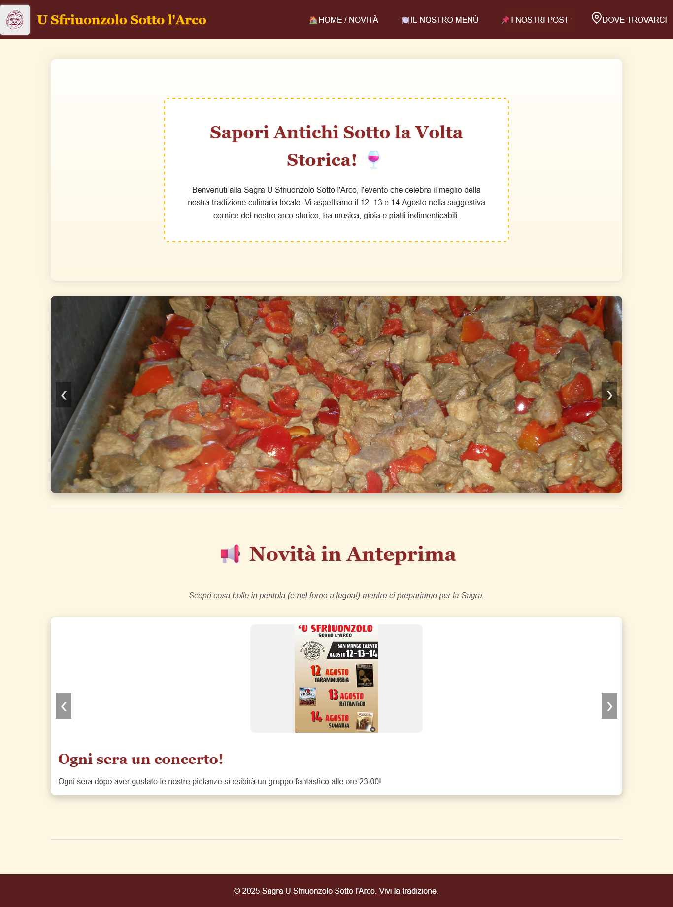

# Sagra U' Sfriuonzolo Sotto l'Arco

**Relazione / Demo Front-End** — sito informativo per la manifestazione del mio paese.

## Descrizione
Progetto realizzato come esercitazione del corso *Riverloop - Front-End* (2025). Fornisce una landing page informativa con sezioni: Home (hero + carosello), News, Menu (card dei piatti), Post multimediali e Location (mappa embed). Tutto implementato in **HTML**, **CSS** e **JavaScript vanilla**.

Il sito è pensato per essere chiaro e accessibile, con contenuti multimediali (immagini e testo) facilmente consultabili. La struttura HTML è volutamente minima: quasi tutti i contenuti dinamici come carosello, news, menu e gallery vengono generati tramite JavaScript a partire da array di dati. Questo approccio rende il sito facilmente estendibile: aggiungendo nuovi elementi agli array non è necessario modificare la struttura HTML, o il codice JavaScript, simulando l’uso di un database esterno.

## Screenshot
**Home (desktop):**  

**Home (mobile):**  

**Menu / Lightbox:**  

**Location / Mappa:**  

## Funzionalità principali
- Navbar e footer inclusi dinamicamente via `fetch`.
- Hero con carosello immagine.
- Carosello separato per le news.
- Pagina Menu con card e lightbox a pieno schermo.
- Sezione Post con immagini ed embed YouTube.
- Iframe Google Maps per la location.
- Layout responsive con approccio **mobile-first**.
- Generazione dinamica di post, menu e gallery tramite JavaScript.
- Tutti i dati principali sono memorizzati in array, rendendo facile aggiungere contenuti senza modificare il codice HTML.

## Tecnologie utilizzate
- **HTML5** (minimale, solo struttura base e contenitori).
- **CSS3** (Grid + Flexbox, media queries) per layout responsive.
- **JavaScript vanilla** per dinamismo, generazione dinamica dei contenuti e manipolazione DOM.
- **Google Maps embed** per la sezione location.
- Nessun framework esterno, per semplicità e leggerezza.

## Esecuzione in locale
1. Clona o scarica il repository.
2. Apri la cartella del progetto in **Visual Studio Code**.
3. Installa l'estensione **Live Server** (se non già installata).
4. Apri `index.html` e avvia Live Server:
   - Clic destro su `index.html` → **Open with Live Server**
   - Oppure scorciatoia: `Alt+L, Alt+O` (VS Code Live Server)
5. Apri la Console del browser (DevTools) per verificare errori

> **Nota:** le inclusioni dinamiche via `fetch` richiedono un server locale (es. Live Server), non funzionano aprendo il file con doppio click (`file://`).

## Struttura dei file
project-folder/
|-- index.html
|-- menu.html
|-- post.html
|-- location.html
|-- navbar.html
|-- footer.html
|-- style.css
|-- script.js
|-- docs/ (screenshot e immagini del sito)
|-- img/ (immagini usate dal sito)

## Test e verifica
- Simulare dispositivi (smartphone/tablet/desktop) con gli strumenti di sviluppo del browser.
- Controllare link, caroselli e lightbox.
- Verificare performance e ottimizzare immagini.
- Controllare che l’aggiunta di nuovi elementi agli array di dati venga visualizzata correttamente senza modifiche all’HTML.

## Problemi riscontrati e soluzioni
Durante lo sviluppo ho incontrato alcune difficoltà, specialmente perché mi sto approcciando da poco ai linguaggi **CSS** e **JavaScript**:

- **CSS**: difficoltà con layout responsive, griglie e allineamento delle card.  
  **Soluzione:** studio di Grid e Flexbox, test di media query per mobile, supporto dell’IA per suggerimenti pratici.

- **JavaScript**: problemi con caroselli, lightbox e generazione dinamica dei post/menu.  
  **Soluzione:** suddivisione del codice in funzioni più piccole e supporto dell’IA per generare blocchi di codice funzionanti.

In generale, l’uso dell’IA mi ha aiutato a comprendere come implementare funzionalità dinamiche, mantenendo il controllo sul codice e sull’apprendimento dei concetti base.

## Note e limitazioni
- La funzione `includeHTML` funziona solo tramite server HTTP(S).  
- Alcuni simboli o emoji potrebbero non renderizzarsi correttamente se il codice viene compilato per stampa in LaTeX o PDF senza font Unicode.
- Tutti i dati principali sono gestiti in JavaScript; modificare gli array aggiorna automaticamente i contenuti senza toccare l’HTML.

## Contatti
**Autore:** Giuseppe Conte  
**Email:** G.CONTE1996@GMAIL.COM
